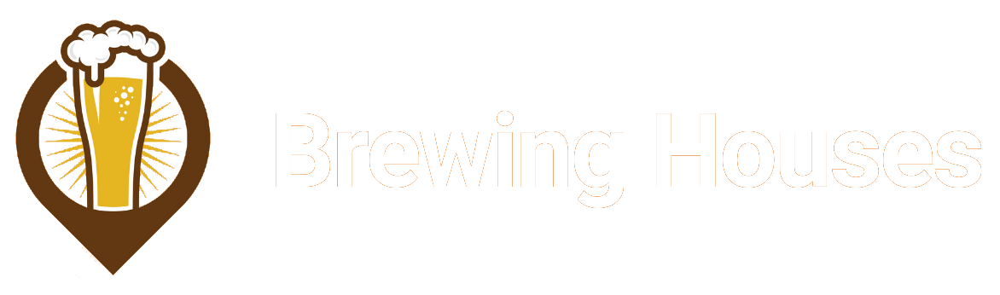

<h1 align="center">
  

<h3 align="center">
  The NextJS app for React to find your brewing houses.
</h3>

<p align="center">The best way to find your brewing houses!</p>

<p align="center">

  

  <a href="https://www.linkedin.com/in/daniel-santos-040983ab/" target="_blank" rel="noopener noreferrer">
    
  </a>

  

  <a href="https://github.com/dvargas42/brewing_houses/commits/main">
    
  </a>

  <a href="https://github.com/dvargas42/brewing_houses/issues">
    
  </a>

  
</p>


<p align="center">
  <a href="#%EF%B8%8F-about-the-project">About the project</a>&nbsp;&nbsp;&nbsp;|&nbsp;&nbsp;&nbsp;
  <a href="#-screnshots">Screenshots</a>&nbsp;&nbsp;&nbsp;|&nbsp;&nbsp;&nbsp;
  <a href="#-technologies">Technologies</a>&nbsp;&nbsp;&nbsp;|&nbsp;&nbsp;&nbsp;
  <a href="#-getting-started">Getting started</a>&nbsp;&nbsp;&nbsp;|&nbsp;&nbsp;&nbsp;
  <a href="#-how-to-contribute">How to contribute</a>&nbsp;&nbsp;&nbsp;|&nbsp;&nbsp;&nbsp;
  <a href="#-license">License</a>
</p>

## 💇🏼 About the project

This application was part of a challenge to test the ability to implement features functions and render information within a ReactJS / NextJS web application.

## 📸 Sreenshots

Images of the application in operation.

<p align="center">


</p>

<p align="center">


</p>

<p align="center">


</p>

## 🚀 Technologies

Technologies that I used to develop this web application


- [React](https://reactjs.org/)
- [Node.js](https://nodejs.org/en/)
- [Next](https://nextjs.org/)
- [TypeScript](https://www.typescriptlang.org/)
- [Axios](https://github.com/axios/axios)
- [React Query](https://react-query.tanstack.com/)
- [Chakra-UI](https://chakra-ui.com/)
- [Framer Motion](https://www.framer.com/motion/)
- [React Icons](https://react-icons.github.io/react-icons/)

## 💻 Getting started

### Requirements

- [Node.js](https://nodejs.org/en/)
- [Yarn](https://classic.yarnpkg.com/) or [npm](https://www.npmjs.com/)


**Clone the project and access the folder**

```bash
$ git clone https://github.com/dvargas42/brewing_houses.git
```

**Follow the steps below**

```bash
# Install the dependencies
$ yarn

# To finish, run the webapp 
$ yarn dev

```
**In another tab or terminal to listen**

To run this app, first, you will need to run the app called frontend-test (shown in the link below) which will provide a mock API with information to populate the brewery table. Remembering that the port used by it is 3000 and our app will be 3333.

- [frontend-test](https://github.com/dvargas42/frontend-test)


```bash
# Run the app to listen app frontend-teste
$ yarn start

# Well done, project is started!
```

## 🤔 How to contribute

**Make a fork of this repository**

```bash
# Fork using GitHub official command line
# If you don't have the GitHub CLI, use the web site to do that.

$ gh repo fork dvargas42/brewing_houses

```

**Follow the steps below**

```bash
# Clone your fork
$ git clone your-fork-url && cd brewing_houses

# Create a branch with your feature
$ git checkout -b my-feature

# Make the commit with your changes
$ git commit -m "My new feature"

# Send the code to your remote branch
$ git push origin my-feature
```

After your pull request is merged, you can delete your branch

## 📝 License

This project is licensed under the MIT License - see the [LICENSE](LICENSE) file for details.

---

Made with 💜 &nbsp;by Daniel Vargas 👋 &nbsp;[See my linkedin](https://www.linkedin.com/in/daniel-santos-040983ab/)
